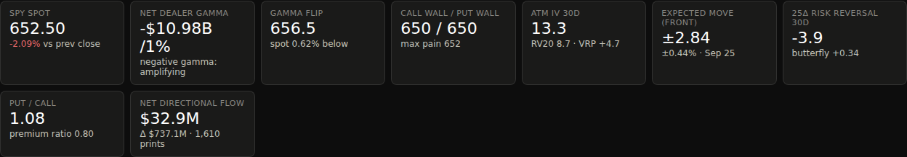
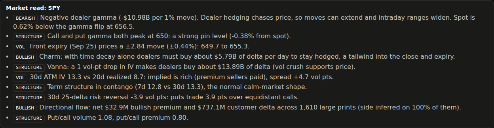
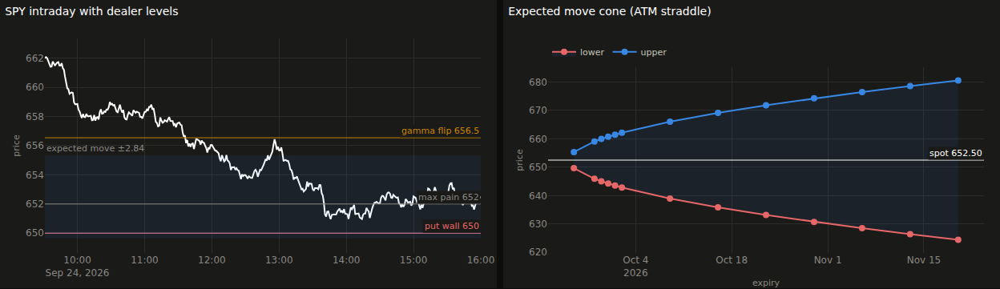
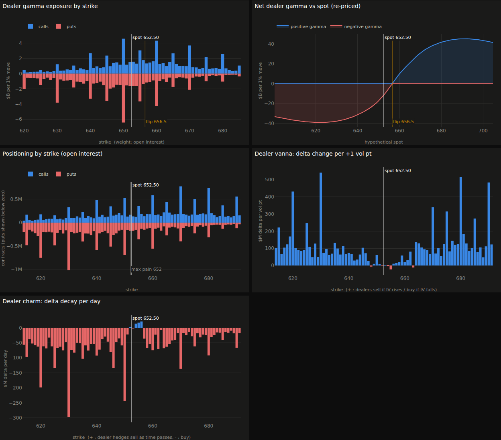
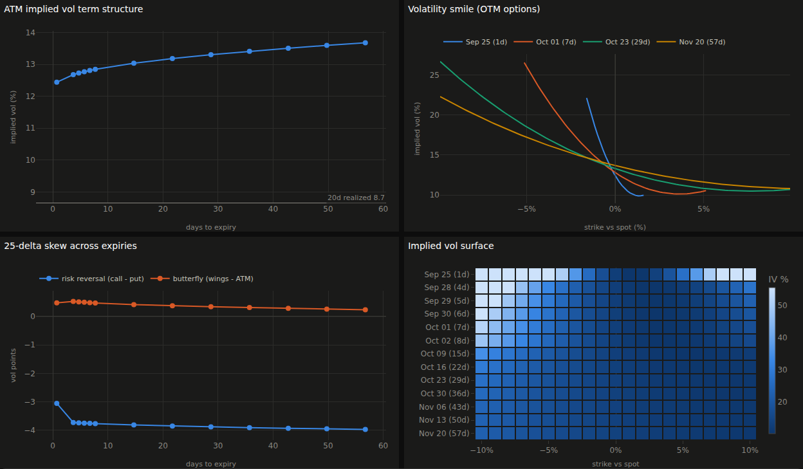
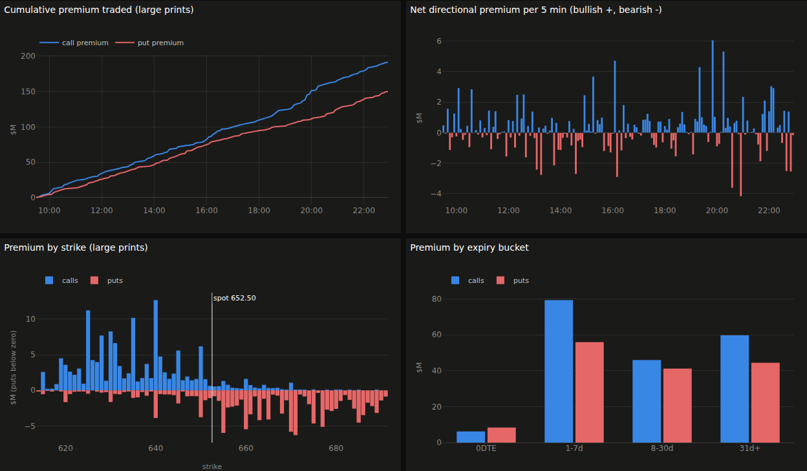
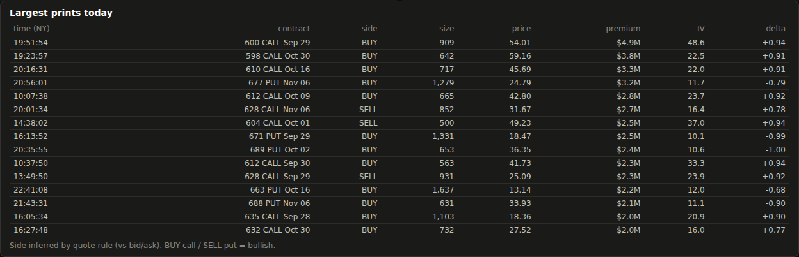
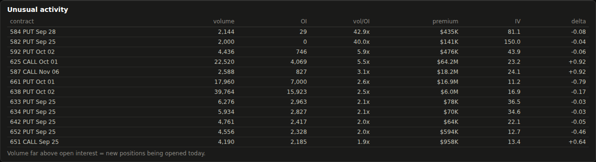

# Options Flow Dashboard: SPY & QQQ

A **live options analytics dashboard** for SPY and QQQ that runs inside a Jupyter notebook, using the
[London Strategic Edge](https://londonstrategicedge.com) (LSE) options API.

It doesn't just list implied volatility and delta. It turns the raw option chain and the tape of trades into what traders
care about: **where dealers are positioned, which price levels matter, how volatility is priced, and which way money is
flowing**. It then writes a short plain-English summary of all of it, and everything refreshes on its own while the market is open.



> Screenshots in this README use the built-in **demo data** (synthetic prices). With your API key in place the same
> screens show live SPY / QQQ data.

---

## Quick start

1. **Get the code**: `git clone https://github.com/tafall77/Options-flow-dashboard` or **Code → Download ZIP**, then
   `pip install -r requirements.txt`.
   Only have the notebook file, or using Google Colab? That works too: the notebook's **Setup** cell downloads the
   dashboard code and its libraries from GitHub automatically.
2. **Paste your API key.** Open `Options_Dashboard.ipynb`; the first code cell is:
   ```python
   LSE_API_KEY = "PASTE_YOUR_LSE_API_KEY_HERE"
   ```
   To keep the key out of the notebook (and out of git), you can instead set an environment variable before
   starting Jupyter: `export LSE_API_KEY=lse_live_xxxxxxxxxxxx`.
3. **Run it**
   ```bash
   jupyter lab Options_Dashboard.ipynb        # then Run → Run All Cells
   ```
   (Or `pip install git+https://github.com/tafall77/Options-flow-dashboard` and use `from optionsdash import ...`
   from any notebook.)

With no key, the dashboard runs on synthetic demo data, so you can check it works before connecting.

**Controls:** a **SPY / QQQ** toggle, **Pause / Resume**, and a refresh-rate picker (5s to 2min). The notebook stays usable
while the dashboard runs.

---

## What the dashboard displays

The top of the screen always shows the headline numbers and the market read. Below them are four tabs:
**Price & Levels**, **Dealer Positioning**, **Volatility** and **Options Flow**.

### 1. Headline numbers

| Tile | What it shows | Why it matters |
|---|---|---|
| **Spot** | Current SPY / QQQ price and % change vs the previous close | Where we are |
| **Net dealer gamma** | Dollars of stock dealers must trade for every 1% move ("GEX") | **Positive** = dealers dampen moves (calmer, mean-reverting). **Negative** = dealers amplify moves (bigger swings) |
| **Gamma flip** | The price where net dealer gamma switches sign, and how far spot is from it | Crossing it tends to change market behaviour, from calm to volatile or back |
| **Call wall / put wall** | Strikes with the most call gamma and the most put gamma | Often act as resistance (call wall) and support (put wall) |
| **Max pain** | Price at which the nearest expiry's options lose the most value | Price often gravitates toward it into expiry |
| **ATM IV 30d** | 30-day at-the-money implied volatility, vs 20-day realized volatility (**VRP** = the gap) | Are options expensive or cheap relative to how much the market actually moves? |
| **Expected move (front)** | ± move priced by the nearest expiry's at-the-money straddle, in $ and % | The range the options market expects for the next expiry |
| **25Δ risk reversal 30d** | Call IV minus put IV at 25-delta, and the 25Δ butterfly | Negative = puts are in demand (hedging / fear). The butterfly shows how expensive the tails are |
| **Put / call** | Put/call ratio by volume and by premium | Sentiment. Heavy put buying is defensive |
| **Net directional flow** | Bullish minus bearish premium from large trades, plus net customer delta | Which way the big money is leaning today |

### 2. Market read



An auto-generated summary of the numbers above, in plain English and tagged **BULLISH / BEARISH / VOL / STRUCTURE**.
It covers the gamma regime, pin levels, the expected range, how time decay (charm) and volatility changes (vanna) push
dealer hedging, whether implied vol is rich or cheap, term-structure shape, skew, and flow bias.

### 3. Price & Levels tab



- **Intraday price with dealer levels:** today's 1-minute price with the **call wall**, **put wall**, **gamma flip**,
  **max pain** and the **expected-move band** drawn on it, so you can see price against the levels that matter.
- **Expected move cone:** the ± range the options market prices for every expiry out to ~60 days, from each expiry's
  at-the-money straddle. It shows how far SPY/QQQ is "expected" to travel by each date.

### 4. Dealer Positioning tab



- **Dealer gamma exposure by strike:** call gamma (blue, up) and put gamma (red, down) at each strike near spot. Tall
  bars are the strikes dealers are most sensitive to: magnets, walls and pin levels.
- **Net dealer gamma vs spot:** total dealer gamma re-calculated as if spot were anywhere within ±8%. Where the curve
  crosses zero is the **gamma flip**. Blue region = dampening regime, red region = amplifying regime.
- **Positioning by strike:** open interest per strike (calls up, puts down), with max pain marked. Shows where the
  positions actually sit.
- **Dealer vanna:** how much dealer hedging changes when implied vol moves 1 point. Explains the "vol crush rally"
  (IV falls, dealers buy) and the reverse.
- **Dealer charm:** how much dealer hedging changes each day from time decay alone. Explains drift into the close
  and into options expiration.

### 5. Volatility tab



- **ATM implied vol term structure:** at-the-money IV for every expiry, with 20-day realized vol as a reference line.
  Upward sloping (contango) is normal and calm. Near-term IV above longer-term (inverted) flags stress or an event.
- **Volatility smile:** implied vol across strikes for four expiries (0, ~7, ~30, ~60 days). The steeper the left side,
  the more investors pay for downside protection.
- **25-delta skew across expiries:** risk reversal (call IV − put IV) and butterfly (wings vs ATM) for each expiry.
  Shows where in time the hedging demand sits.
- **Implied vol surface:** a heatmap of IV by expiry (rows) and strike distance from spot (columns). Brighter = more
  expensive options.
- **Expiry summary table:** per expiry: days to expiry, ATM IV, 25Δ risk reversal and butterfly, expected move in $ and
  %, and volume.

### 6. Options Flow tab



- **Cumulative premium traded:** running total of dollars spent on calls vs puts through the day, from large trades
  (≥ $25k by default).
- **Net directional premium per 5 min:** bullish flow (calls bought + puts sold) minus bearish flow (puts bought +
  calls sold) in each 5-minute window. Blue bars = bullish, red = bearish.
- **Premium by strike:** where the money is going. Call premium above zero, put premium below, near spot.
- **Premium by expiry bucket:** call vs put premium in 0DTE, 1–7 days, 8–30 days and 31+ days. Separates same-day
  speculation from longer-dated positioning.

**Largest prints today:** the biggest trades with time, contract, **BUY / SELL** side, size, price, premium, IV and delta.



**Unusual activity:** contracts trading far more volume than their open interest, i.e. **new positions** being opened today.



When a live key is used, a **live tape** of real-time option trades streamed over WebSocket also appears at the bottom of
this tab.

---

## Troubleshooting

| Message | Fix |
|---|---|
| `No module named 'optionsdash'` | Open the notebook from inside the repo folder, or just run the **Setup** cell: it downloads the code from GitHub |
| `Please install anywidget to use the FigureWidget class` / status bar says **simple chart mode** | Run `pip install -r requirements.txt` (or re-run the Setup cell), then **Kernel → Restart Kernel** and run all cells. In simple mode the dashboard still works; charts are just redrawn instead of updated in place |
| Setup cell says *"Installed. Now restart the kernel"* | Libraries were installed after plotly was already loaded: restart the kernel and run all cells |
| Status bar shows **update failed** | The error text is shown there; `dash.last_error` has the full traceback (e.g. a wrong API key) |

## Extras

```python
dash.save_html("options_dashboard.html")   # shareable snapshot of every chart & table (SPY and QQQ)
dash.show_static("SPY")                    # plain charts for front-ends without widget support
snap = dash.snapshots["SPY"]               # the numbers behind the charts, as pandas DataFrames
snap.metrics, snap.term, snap.exposure, snap.chain, snap.flow
```

## Settings (first notebook cell)

| Setting | Default | Meaning |
|---|---|---|
| `SYMBOLS` | `["SPY", "QQQ"]` | Underlyings on the toggle |
| `REFRESH_SECONDS` | 15 | How often price, flow and headline numbers update |
| `CHAIN_REFRESH_SECONDS` | 60 | How often the full option chain is re-pulled (the heaviest call) |
| `MAX_DTE` | 60 | Furthest expiry included (days) |
| `FLOW_MIN_PREMIUM` | 25,000 | Only trades at or above this $ premium feed the flow panels |
| `USE_WEBSOCKET` | True | Stream real-time spot and option trades |

## How the numbers are calculated

- **Dealer exposure (gamma, vanna, charm)** uses the standard street assumption that customers are net long puts and net
  short calls, so dealers are long call gamma and short put gamma. It's a model estimate of positioning, not a view
  of actual dealer books.
- **Positioning weight** is open interest when the API provides it. Otherwise it falls back to today's volume, and the
  charts say so.
- **Greeks** come from the API where available and from Black-Scholes otherwise. The gamma-flip curve re-prices every
  contract at each hypothetical spot.
- **ATM IV** is interpolated at spot from out-of-the-money options. The 30-day value uses constant-maturity (variance-time)
  interpolation. **Realized vol** is 20-day close-to-close, annualized.
- **Trade side (BUY/SELL)** uses the quote rule (trade price vs bid/ask mid) when quotes are present, otherwise a tick
  test. The market read reports what share of trades had a known side.
- Contracts that have already expired (after the 4pm ET close on expiry day) are dropped from the chain.

## Project layout

```
Options_Dashboard.ipynb   main entry point: API key cell, setup, launch, how-to-read notes
pyproject.toml            makes optionsdash pip-installable (the notebook's setup cell uses this)
optionsdash/
  feed.py        LSE data feed (REST chain / flow / candles + WebSocket) and the offline demo feed
  analytics.py   greeks, GEX / vanna / charm, gamma flip, walls, max pain, term structure, skew,
                 expected moves, realized vol, trade-side classification, market read
  charts.py      Plotly charts, headline tiles and tables
  dashboard.py   live ipywidgets dashboard, refresh loop, static view, HTML export
  theme.py       dark theme and colorblind-checked palette
docs/img/        README screenshots
```

---

*For research and education. The dashboard shows model-based estimates, not trading advice.*
